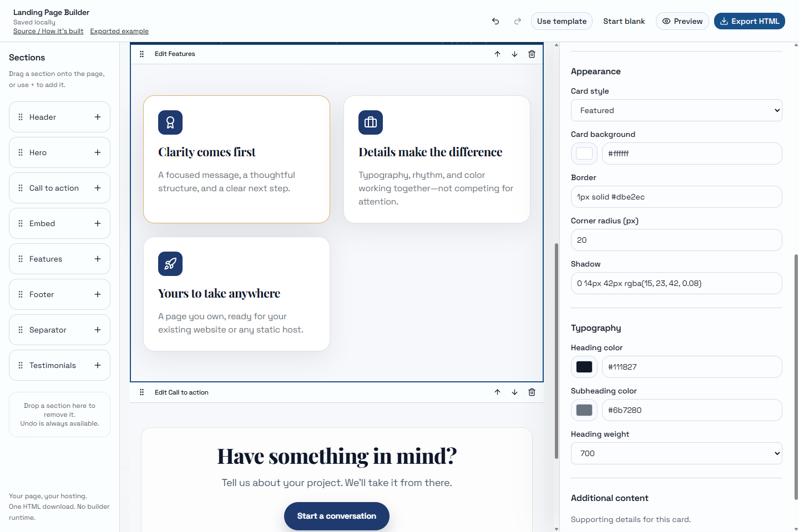
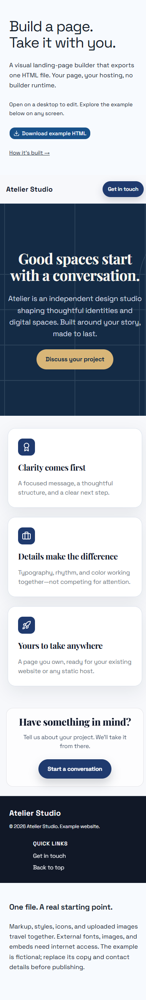

# Landing Page Builder

**Build a page. Take it with you.** A visual landing-page editor that exports one `index.html` for static hosting, without a builder runtime or React hydration requirement.

[Live editor](https://ivogeorgievx.github.io/lpb/) · [Example exported HTML](https://ivogeorgievx.github.io/lpb/example.html) · [Technical case study](docs/portfolio-case-study.md)

## Try it

1. Open the editor on a desktop and choose **Use the studio template** or **Start blank**.
2. Select a section to edit it. Add sections with **+**, or use drag handles; move/remove controls also work with a keyboard.
3. Change the theme in **Page settings**. Content and section order stay intact; custom colors remain custom.
4. Check **Preview** at desktop/mobile widths, then **Export HTML**.
5. Upload `index.html` to a static host or an existing web server. No install or build step is needed for the exported page.

Drafts save on this device. Undo/redo works through the toolbar or **Ctrl/Cmd+Z**, **Ctrl/Cmd+Shift+Z**, and **Ctrl+Y**. Mobile visitors can explore and download the example page; editing requires a viewport at least 1024 CSS pixels wide.





## Export contract

| Included in the HTML              | External resources                     |
| --------------------------------- | -------------------------------------- |
| Page markup and shared output CSS | Google Fonts for the selected theme    |
| Supported icons as inline SVG     | Remote image URLs supplied by the user |
| Uploaded hero images as data URLs | Embedded content and its provider      |
| Page title and description        | Destinations of configured links       |

The export is one file for **online static hosting**, not an entirely offline website. It does not provide form processing, payments, accounts, or a database. Links accept HTTP(S), `mailto:`, `tel:`, and page anchors; embeds require absolute HTTP(S) URLs. Unsupported link schemes fall back to `#`; invalid embeds show the empty state.

Uploaded hero images accept JPG, PNG, WebP, and GIF up to **1 MB each**. Supported icon names are `award`, `rocket`, `briefcase`, `check`, `star`, `heart`, `shield`, `zap`, `globe`, `leaf` (plain, `lucide-`, or `icon-` prefixes). Unknown names use a circle rather than a network font.

The studio template is fictional, with an original embedded SVG illustration. Replace its example copy and email address before publishing.

## Run locally

Use **Node.js 22 or newer** and npm.

```sh
npm ci
npm run dev
```

Open `http://localhost:3000`. Both `dev` and `build` generate `public/example.html` from the real export pipeline. The generated file is ignored by Git; regenerate it directly with `npm run example`.

```sh
npm run typecheck
npm run lint
npm run format:check
npm test
npm run build
npx playwright install chromium
npm run test:e2e
npm start
```

`npm run build` produces the static app in `out/`. `npm start` serves that build at `http://127.0.0.1:4173` using a small Node static server. The browser test starts and stops the same server automatically; stop a manually started preview before running the test. It also checks repository-prefixed URLs in CI. The GitHub Pages workflow verifies pull requests and deploys pushes to `main` after the browser check passes.

Use `npm run format` to format the application source consistently. Browser failures retain a trace in `test-results/`; inspect it with `npx playwright show-trace <trace.zip>`.

## How it works

```text
Document (blocks + theme + metadata)
  ├─ Shared block registry + shared CSS → editing canvas
  └─ One static React render → HTML string
       ├─ Sandbox iframe → preview
       └─ Blob download → index.html
```

- `lib/blocks.tsx`: block types, defaults, registry, and creation.
- `lib/document.ts`: versioned draft validation, document history, and input boundaries.
- `hooks/use-document.ts`: browser storage, save feedback, and history shortcuts.
- `lib/export.tsx` / `lib/exportCss.ts`: document serialization, theme-specific font loading, and shared output styling.
- `lib/template.ts`: the example document and embedded illustration.
- `scripts/check.cjs`: dependency-free Node assertions using the installed TypeScript compiler to load the real TS/TSX modules.
- `tests/e2e/editor.spec.ts`: one Chromium journey covering editing, image upload, undo, draft recovery, preview anchors, responsive controls, color validation, independent HTML export, and item limits.
- `tests/block-types.ts`: compile-time regression check for block-discriminated fields.

The builder uses Next.js, React, TypeScript, Tailwind, Radix UI, dnd-kit, and Lucide. These are editor dependencies; they are not required to host the downloaded page.

## Deliberate limits

- One draft per browser origin, stored locally—not synced across devices or tabs. Concurrent editing in multiple tabs can overwrite a draft.
- Undo/redo retains 40 document snapshots and groups continuous changes within 800 ms. History resets on reload; the draft does not.
- Pages support up to 200 sections; feature cards, supporting details, footer links, and embed bullet lists each support up to 200 entries. Testimonial carousels support up to nine slides. These limits are enforced before saving so allowed documents can be restored.
- Background controls accept colors and gradients. Text and icon controls accept solid CSS colors; invalid entries show feedback without overwriting the last valid value. Escape cancels an invalid color edit.
- Storage quotas vary. A failed save is shown explicitly; export your page before closing. Invalid stored drafts are not overwritten until you begin editing a new document.
- Exported HTML is a delivery format, not an importable project backup.
- Embed providers may prohibit framing; external resource availability remains outside the builder’s control.

See the [case study](docs/portfolio-case-study.md) for the engineering trade-offs and verification approach.
